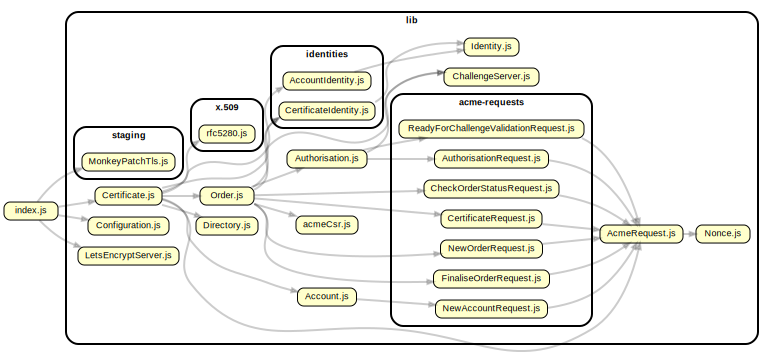

# Developer Documentation

This documentation includes the implementation details of Auto Encrypt and is intended to aid you if you’re trying to improve, debug, or get a deeper understanding of Auto Encrypt.

If you just want to use Auto Encrypt, please see the public API, as documented in the [README](readme.md).

The developer documentation is generated using [jsdoc-to-markdown](https://github.com/jsdoc2md/jsdoc-to-markdown) from the [developer-documentation.hbs](./developer-documentation.hbs) template.

To update the documentation:

```sh
npm run generate-developer-documentation
```

## Like this? Fund us!

[Small Technology Foundation](https://small-tech.org) is a tiny, independent not-for-profit.

We exist in part thanks to patronage by people like you. If you share [our vision](https://small-tech.org/about/#small-technology) and want to support our work, please [become a patron or donate to us](https://small-tech.org/fund-us) today and help us continue to exist.

## Requirements

Auto Encrypt is supported on:

  - __Node:__ LTS (currently 12.16.1).
  - __ECMAScript:__ [ES2019](https://node.green/#ES2019)

## Overview of relationships



__Not shown (for clarity):__ third-party Node modules, the `util` namespace with helper modules – for logging, error handling, and an async `forEach` implementation – and the `typedefs` namespace with JSDoc type definitions.

Generated using [dependency cruiser](https://github.com/sverweij/dependency-cruiser).

## Tests

Main test tasks use an automatically-managed local Pebble server instance with settings optimised for performance.

```sh
npm run test
```

Tests should also pass with Pebble’s default settings and with the Let’s Encrypt staging server. The full set of test tasks are:

| Name                                | Server  | Sleep? | Nonce reject? | Debug output? |
|-------------------------------------|---------|--------|---------------|---------------|
| test                                | Pebble  |   ✘    |       ✘       |       ✘       |
| test-debug                          | Pebble  |   ✘    |       ✘       |       ✔       |
| test-pebble-sleep                   | Pebble  |   ✔    |       ✘       |       ✘       |
| test-pebble-sleep-debug             | Pebble  |   ✔    |       ✘       |       ✔       |
| test-pebble-sleep-noncereject       | Pebble  |   ✔    |       ✔       |       ✘       |
| test-pebble-sleep-noncereject-debug | Pebble  |   ✔    |       ✔       |       ✔       |
| test-staging                        | Staging |  n/a   |      n/a      |       ✘       |
| test-staging-debug                  | Staging |  n/a   |      n/a      |       ✔       |

## Coverage

There are several different code coverage tasks that correspond to the test tasks. Coverage task names begin with _coverage_ instead of _test_ and there are no debug versions for them.

```sh
npm run coverage
```

The full set of coverage tasks are:

| Name                                    | Server  | Sleep? | Nonce reject? |
|-----------------------------------------|---------|--------|---------------|
| coverage                                | Pebble  |   ✘    |       ✘       |
| coverage-pebble-sleep                   | Pebble  |   ✔    |       ✘       |
| coverage-pebble-sleep-noncereject       | Pebble  |   ✔    |       ✔       |
| coverage-staging                        | Staging |  n/a   |      n/a      |

## Modules

<dl>
<dt><a href="#module_@small-tech/auto-encrypt">@small-tech/auto-encrypt</a></dt>
<dd><p>Automatically provisions and renews Let’s Encrypt™ TLS certificates for
Node.js® https servers (including Express.js, etc.)</p>
<p>Implements the subset of RFC 8555 – Automatic Certificate Management
Environment (ACME) – necessary for a Node.js https server to provision TLS
certificates from Let’s Encrypt using the HTTP-01 challenge on first
hit of an HTTPS route via use of the Server Name Indication (SNI) callback.</p>
</dd>
<dt><a href="#module_lib/AcmeRequest">lib/AcmeRequest</a></dt>
<dd><p>Abstract base request class for carrying out signed ACME requests over HTTPS.</p>
</dd>
<dt><a href="#module_lib/Certificate">lib/Certificate</a></dt>
<dd><p>Represents a Let’s Encrypt TLS certificate.</p>
</dd>
<dt><a href="#module_lib/Configuration">lib/Configuration</a></dt>
<dd><p>Global configuration class. Use initialise() method to populate.</p>
</dd>
</dl>

## Classes

<dl>
<dt><a href="#Order">Order</a></dt>
<dd></dd>
</dl>

## Functions

<dl>
<dt><a href="#csrAsPem">csrAsPem(domains, key)</a> ⇒ <code>String</code></dt>
<dd><p>Create a CSR given a list of domains and a Jose JWK.rsaKey.</p>
</dd>
</dl>

## Typedefs

<dl>
<dt><a href="#PreparedRequest">PreparedRequest</a> : <code>Object</code></dt>
<dd></dd>
<dt><a href="#ProtectedHeader">ProtectedHeader</a></dt>
<dd></dd>
<dt><a href="#HttpsHeaders">HttpsHeaders</a> : <code>Object</code></dt>
<dd></dd>
<dt><a href="#ResponseObject">ResponseObject</a></dt>
<dd></dd>
</dl>

<a name="module_@small-tech/auto-encrypt"></a>

## @small-tech/auto-encrypt
Automatically provisions and renews Let’s Encrypt™ TLS certificates for
Node.js® https servers (including Express.js, etc.)

Implements the subset of RFC 8555 – Automatic Certificate Management
Environment (ACME) – necessary for a Node.js https server to provision TLS
certificates from Let’s Encrypt using the HTTP-01 challenge on first
hit of an HTTPS route via use of the Server Name Indication (SNI) callback.

**License**: AGPLv3 or later.  
**Copyright**: © 2020 Aral Balkan, Small Technology Foundation.  

* [@small-tech/auto-encrypt](#module_@small-tech/auto-encrypt)
    * [AutoEncrypt](#exp_module_@small-tech/auto-encrypt--AutoEncrypt) ⏏
        * _instance_
            * [.serverType](#module_@small-tech/auto-encrypt--AutoEncrypt+serverType) : <code>LetsEncryptServer.type</code>
        * _static_
            * [.https](#module_@small-tech/auto-encrypt--AutoEncrypt.https)
            * [.createServer([options])](#module_@small-tech/auto-encrypt--AutoEncrypt.createServer) ⇒ <code>https.Server</code>
            * [.clearOcspCacheTimers()](#module_@small-tech/auto-encrypt--AutoEncrypt.clearOcspCacheTimers)
            * [.shutdown()](#module_@small-tech/auto-encrypt--AutoEncrypt.shutdown)
            * [.addOcspStapling(server)](#module_@small-tech/auto-encrypt--AutoEncrypt.addOcspStapling) ⇒ <code>https.Server</code> ℗

<a name="exp_module_@small-tech/auto-encrypt--AutoEncrypt"></a>

### AutoEncrypt ⏏
Auto Encrypt is a static class. Please do not instantiate.

Use: AutoEncrypt.https.createServer(…)

**Kind**: Exported class  
<a name="module_@small-tech/auto-encrypt--AutoEncrypt+serverType"></a>

#### autoEncrypt.serverType : <code>LetsEncryptServer.type</code>
Enumeration.

**Kind**: instance property of [<code>AutoEncrypt</code>](#exp_module_@small-tech/auto-encrypt--AutoEncrypt)  
**Read only**: true  
<a name="module_@small-tech/auto-encrypt--AutoEncrypt.https"></a>

#### AutoEncrypt.https
By aliasing the https property to the AutoEncrypt static class itself, we enable
people to add AutoEncrypt to their existing apps by requiring the module
and prefixing their https.createServer(…) line with AutoEncrypt:

**Kind**: static property of [<code>AutoEncrypt</code>](#exp_module_@small-tech/auto-encrypt--AutoEncrypt)  
**Example**  
```js
const AutoEncrypt = require('@small-tech/auto-encrypt')
const server = AutoEncrypt.https.createServer()
```
<a name="module_@small-tech/auto-encrypt--AutoEncrypt.createServer"></a>

#### AutoEncrypt.createServer([options]) ⇒ <code>https.Server</code>
Automatically manages Let’s Encrypt certificate provisioning and renewal for Node.js
https servers using the HTTP-01 challenge on first hit of an HTTPS route via use of
the Server Name Indication (SNI) callback.

**Kind**: static method of [<code>AutoEncrypt</code>](#exp_module_@small-tech/auto-encrypt--AutoEncrypt)  
**Returns**: <code>https.Server</code> - The server instance returned by Node’s https.createServer() method.  

| Param | Type | Default | Description |
| --- | --- | --- | --- |
| [options] | <code>Object</code> |  | Optional HTTPS options object with optional additional                                           Auto Encrypt-specific configuration settings. |
| [options.domains] | <code>Array.&lt;String&gt;</code> |  | Domain names to provision TLS certificates for. If missing, defaults to                                           the hostname of the current computer and its www prefixed subdomain. |
| [options.serverType] | <code>Enum</code> | <code>AutoEncrypt.serverType.PRODUCTION</code> | Let’s Encrypt server type to use.                                                                  AutoEncrypt.serverType.PRODUCTION, ….STAGING,                                                                  or ….PEBBLE (see LetsEncryptServer.type). |
| [options.settingsPath] | <code>String</code> | <code>~/.small-tech.org/auto-encrypt/</code> | Path to save certificates/keys to. |

<a name="module_@small-tech/auto-encrypt--AutoEncrypt.clearOcspCacheTimers"></a>

#### AutoEncrypt.clearOcspCacheTimers()
The OCSP module does not have a means of clearing its cache check timers
so we do it here. (Otherwise, the test suite would hang.)

**Kind**: static method of [<code>AutoEncrypt</code>](#exp_module_@small-tech/auto-encrypt--AutoEncrypt)  
<a name="module_@small-tech/auto-encrypt--AutoEncrypt.shutdown"></a>

#### AutoEncrypt.shutdown()
Shut Auto Encrypt down. Do this before app exit. Performs necessary clean-up and removes
any references that might cause the app to not exit.

**Kind**: static method of [<code>AutoEncrypt</code>](#exp_module_@small-tech/auto-encrypt--AutoEncrypt)  
<a name="module_@small-tech/auto-encrypt--AutoEncrypt.addOcspStapling"></a>

#### AutoEncrypt.addOcspStapling(server) ⇒ <code>https.Server</code> ℗
Adds Online Certificate Status Protocol (OCSP) stapling (also known as TLS Certificate Status Request extension)
support to the passed server instance.

**Kind**: static method of [<code>AutoEncrypt</code>](#exp_module_@small-tech/auto-encrypt--AutoEncrypt)  
**Returns**: <code>https.Server</code> - HTTPS server instance with OCSP Stapling support.  
**Access**: private  

| Param | Type | Description |
| --- | --- | --- |
| server | <code>https.Server</code> | HTTPS server instance without OCSP Stapling support. |

<a name="module_lib/AcmeRequest"></a>

## lib/AcmeRequest
Abstract base request class for carrying out signed ACME requests over HTTPS.

**License**: AGPLv3 or later.  
**Copyright**: Copyright © 2020 Aral Balkan, Small Technology Foundation.  

* [lib/AcmeRequest](#module_lib/AcmeRequest)
    * [AcmeRequest](#exp_module_lib/AcmeRequest--AcmeRequest) ⏏
        * [.execute(command, payload, useKid, [successCodes], [url], [parseResponseBodyAsJSON])](#module_lib/AcmeRequest--AcmeRequest+execute) ⇒ <code>types.ResponseObject</code>
        * [._execute(preparedRequest, parseResponseBodyAsJSON)](#module_lib/AcmeRequest--AcmeRequest+_execute) ⇒ <code>types.ResponseObject</code>
        * [.getBuffer(stream)](#module_lib/AcmeRequest--AcmeRequest+getBuffer) ⇒ <code>Buffer</code>
        * [.prepare(command, payload, useKid, [successCodes], [url])](#module_lib/AcmeRequest--AcmeRequest+prepare) ⇒ <code>types.PreparedRequest</code>

<a name="exp_module_lib/AcmeRequest--AcmeRequest"></a>

### AcmeRequest ⏏
Abstract base request class for carrying out signed ACME requests over HTTPS.

**Kind**: Exported class  
<a name="module_lib/AcmeRequest--AcmeRequest+execute"></a>

#### acmeRequest.execute(command, payload, useKid, [successCodes], [url], [parseResponseBodyAsJSON]) ⇒ <code>types.ResponseObject</code>
Executes a remote Let’s Encrypt command and either returns the result or throws.

**Kind**: instance method of [<code>AcmeRequest</code>](#exp_module_lib/AcmeRequest--AcmeRequest)  

| Param | Type | Default | Description |
| --- | --- | --- | --- |
| command | <code>String</code> |  | Name of [Directory](Directory) command to invoke e.g. 'newAccount' |
| payload | <code>Object</code> \| <code>String</code> |  | Object to use as payload. For no payload, pass empty string. |
| useKid | <code>Boolean</code> | <code>true</code> | Use Key ID (true) or public JWK (false) (see RFC 8555 § 6.2). |
| [successCodes] | <code>Array.&lt;Number&gt;</code> | <code>[200]</code> | Return codes accepted as success. Any other code throws. |
| [url] | <code>String</code> | <code></code> | If specified, use this URL, ignoring the command parameter. |
| [parseResponseBodyAsJSON] | <code>Boolean</code> | <code>true</code> | Parse response body as JSON (true) or as string (false). |

<a name="module_lib/AcmeRequest--AcmeRequest+_execute"></a>

#### acmeRequest.\_execute(preparedRequest, parseResponseBodyAsJSON) ⇒ <code>types.ResponseObject</code>
Executes a prepared request.

**Kind**: instance method of [<code>AcmeRequest</code>](#exp_module_lib/AcmeRequest--AcmeRequest)  

| Param | Type | Description |
| --- | --- | --- |
| preparedRequest | <code>types.PreparedRequest</code> | The prepared request, ready to be executed. |
| parseResponseBodyAsJSON | <code>Boolean</code> | Should the request body be parsed as JSON (true) or should                                                        the native response object be returned (false). |

<a name="module_lib/AcmeRequest--AcmeRequest+getBuffer"></a>

#### acmeRequest.getBuffer(stream) ⇒ <code>Buffer</code>
Concatenates the output of a stream and returns a buffer. Taken from the bent module.

**Kind**: instance method of [<code>AcmeRequest</code>](#exp_module_lib/AcmeRequest--AcmeRequest)  
**Returns**: <code>Buffer</code> - The concatenated output of the Node stream.  

| Param | Type | Description |
| --- | --- | --- |
| stream | <code>stream</code> | A Node stream. |

<a name="module_lib/AcmeRequest--AcmeRequest+prepare"></a>

#### acmeRequest.prepare(command, payload, useKid, [successCodes], [url]) ⇒ <code>types.PreparedRequest</code>
Separate the preparation of a request from the execution of it so we can easily test
that different request configurations conform to our expectations.

**Kind**: instance method of [<code>AcmeRequest</code>](#exp_module_lib/AcmeRequest--AcmeRequest)  

| Param | Type | Default | Description |
| --- | --- | --- | --- |
| command | <code>String</code> |  | (Required) Name of Let’s Encrypt command to invoke (see Directory).                                             (sans 'Url' suffix). e.g. 'newAccount', 'newOrder', etc. |
| payload | <code>Object</code> \| <code>String</code> |  | (Required) Either an object to use as the payload or, if there is no                                             payload, an empty string. |
| useKid | <code>Boolean</code> |  | (Required) Should request use a Key ID (true) or, public JWK (false).                                             (See RFC 8555 § 6.2 Request Authentication) |
| [successCodes] | <code>Array.&lt;Number&gt;</code> | <code>[200]</code> | Optional array of codes that signals success. Any other code throws. |
| [url] | <code>String</code> | <code></code> | If specified, will use this URL directly, ignoring the value in                                             the command parameter. |

<a name="module_lib/Certificate"></a>

## lib/Certificate
Represents a Let’s Encrypt TLS certificate.

**License**: AGPLv3 or later.  
**Copyright**: Copyright © 2020 Aral Balkan, Small Technology Foundation.  

* [lib/Certificate](#module_lib/Certificate)
    * [Certificate](#exp_module_lib/Certificate--Certificate) ⏏
        * [new Certificate(configuration)](#new_module_lib/Certificate--Certificate_new)
        * [.attemptToRecoverFromFailedRenewalAttemptIfNecessary()](#module_lib/Certificate--Certificate+attemptToRecoverFromFailedRenewalAttemptIfNecessary)
        * [.util.inspect.custom()](#module_lib/Certificate--Certificate+util.inspect.custom)
        * _async_
            * [.getSecureContext()](#module_lib/Certificate--Certificate+getSecureContext) ⇒ <code>Promise.&lt;tls.SecureContext&gt;</code>
            * [.createSecureContext(renewCertificate)](#module_lib/Certificate--Certificate+createSecureContext) ⇒ <code>Promise</code> ℗
            * [.provisionCertificate()](#module_lib/Certificate--Certificate+provisionCertificate) ⇒ <code>Promise</code> ℗
            * [.renewCertificate()](#module_lib/Certificate--Certificate+renewCertificate) ⇒ <code>Promise</code> ℗
            * [.checkForRenewal()](#module_lib/Certificate--Certificate+checkForRenewal) ⇒ <code>Promise</code> ℗
        * _sync_
            * [.startCheckingForRenewal([alsoCheckNow])](#module_lib/Certificate--Certificate+startCheckingForRenewal) ℗
            * [.stopCheckingForRenewal()](#module_lib/Certificate--Certificate+stopCheckingForRenewal) ℗

<a name="exp_module_lib/Certificate--Certificate"></a>

### Certificate ⏏
Represents a Let’s Encrypt TLS certificate.

**Kind**: Exported class  
<a name="new_module_lib/Certificate--Certificate_new"></a>

#### new Certificate(configuration)
Creates an instance of Certificate.


| Param | Type | Description |
| --- | --- | --- |
| configuration | <code>Configuration</code> | Configuration instance. |

<a name="module_lib/Certificate--Certificate+attemptToRecoverFromFailedRenewalAttemptIfNecessary"></a>

#### certificate.attemptToRecoverFromFailedRenewalAttemptIfNecessary()
Check if certificate-identity.pem.old or certificate.pem.old files exist.
If they do, it means that something went wrong while  certificate was trying to be
renewed. So restore them and use them and hopefully the next renewal attempt will
succeed or at least buy the administrator of the server some time to fix the issue.

**Kind**: instance method of [<code>Certificate</code>](#exp_module_lib/Certificate--Certificate)  
<a name="module_lib/Certificate--Certificate+util.inspect.custom"></a>

#### certificate.util.inspect.custom()
Custom inspection string.

**Kind**: instance method of [<code>Certificate</code>](#exp_module_lib/Certificate--Certificate)  
<a name="module_lib/Certificate--Certificate+getSecureContext"></a>

#### certificate.getSecureContext() ⇒ <code>Promise.&lt;tls.SecureContext&gt;</code>
Get a SecureContext that can be used in an SNICallback.

**Kind**: instance method of [<code>Certificate</code>](#exp_module_lib/Certificate--Certificate)  
**Returns**: <code>Promise.&lt;tls.SecureContext&gt;</code> - A promise for a SecureContext that can be used in creating https servers.  
**Category**: async  
<a name="module_lib/Certificate--Certificate+createSecureContext"></a>

#### certificate.createSecureContext(renewCertificate) ⇒ <code>Promise</code> ℗
Creates and caches a secure context, provisioning a TLS certificate in the process, if necessary.

**Kind**: instance method of [<code>Certificate</code>](#exp_module_lib/Certificate--Certificate)  
**Returns**: <code>Promise</code> - Fulfils immediately if certificate exists and does not need to be
                                  renewed. Otherwise, fulfils when certificate has been provisioned.  
**Category**: async  
**Access**: private  

| Param | Type | Default | Description |
| --- | --- | --- | --- |
| renewCertificate | <code>Boolean</code> | <code>false</code> | If true, will start the process of renewing the certificate                                   (but will continue to return the existing certificate until it is ready). |

<a name="module_lib/Certificate--Certificate+provisionCertificate"></a>

#### certificate.provisionCertificate() ⇒ <code>Promise</code> ℗
Provisions a new Let’s Encrypt TLS certificate, persists it, and starts checking for
renewals on it every day, starting with the next day.

**Kind**: instance method of [<code>Certificate</code>](#exp_module_lib/Certificate--Certificate)  
**Returns**: <code>Promise</code> - Fulfils once a certificate has been provisioned.  
**Category**: async  
**Access**: private  
<a name="module_lib/Certificate--Certificate+renewCertificate"></a>

#### certificate.renewCertificate() ⇒ <code>Promise</code> ℗
Starts the certificate renewal process by requesting the creation of a fresh secure context.

**Kind**: instance method of [<code>Certificate</code>](#exp_module_lib/Certificate--Certificate)  
**Returns**: <code>Promise</code> - Resolves once certificate is renewed and new secure context is
                              created and cached.  
**Category**: async  
**Access**: private  
<a name="module_lib/Certificate--Certificate+checkForRenewal"></a>

#### certificate.checkForRenewal() ⇒ <code>Promise</code> ℗
Checks if the certificate needs to be renewed (if it is within 30 days of its expiry date) and, if so,
renews it. While the method is async, the result is not awaited on usage. Instead, it is a fire-and-forget
method that’s called via a daily interval.

**Kind**: instance method of [<code>Certificate</code>](#exp_module_lib/Certificate--Certificate)  
**Returns**: <code>Promise</code> - Fulfils immediately if certificate doesn’t need renewal. Otherwise, fulfils once certificate
                   has been renewed.  
**Category**: async  
**Access**: private  
<a name="module_lib/Certificate--Certificate+startCheckingForRenewal"></a>

#### certificate.startCheckingForRenewal([alsoCheckNow]) ℗
Starts checking for certificate renewals every 24 hours.

**Kind**: instance method of [<code>Certificate</code>](#exp_module_lib/Certificate--Certificate)  
**Category**: sync  
**Access**: private  

| Param | Type | Default | Description |
| --- | --- | --- | --- |
| [alsoCheckNow] | <code>boolean</code> | <code>false</code> | If true, will also immediately check for renewal when the function is                                       called (use this when loading a previously-provisioned and persisted                                       certificate from disk). |

<a name="module_lib/Certificate--Certificate+stopCheckingForRenewal"></a>

#### certificate.stopCheckingForRenewal() ℗
Stops the timer that checks for renewal daily. Use this during housekeeping before destroying this object.

**Kind**: instance method of [<code>Certificate</code>](#exp_module_lib/Certificate--Certificate)  
**Category**: sync  
**Access**: private  
<a name="module_lib/Configuration"></a>

## lib/Configuration
Global configuration class. Use initialise() method to populate.

**License**: AGPLv3 or later.  
**Copyright**: © 2020 Aral Balkan, Small Technology Foundation.  

* [lib/Configuration](#module_lib/Configuration)
    * [Configuration](#exp_module_lib/Configuration--Configuration) ⏏
        * [new Configuration(settings)](#new_module_lib/Configuration--Configuration_new)
        * [.server](#module_lib/Configuration--Configuration+server) : <code>LetsEncryptServer</code>
        * [.domains](#module_lib/Configuration--Configuration+domains) : <code>Array.&lt;String&gt;</code>
        * [.settingsPath](#module_lib/Configuration--Configuration+settingsPath) : <code>String</code>
        * [.accountPath](#module_lib/Configuration--Configuration+accountPath) : <code>String</code>
        * [.accountIdentityPath](#module_lib/Configuration--Configuration+accountIdentityPath) : <code>String</code>
        * [.certificatePath](#module_lib/Configuration--Configuration+certificatePath) : <code>String</code>
        * [.certificateDirectoryPath](#module_lib/Configuration--Configuration+certificateDirectoryPath) : <code>String</code>
        * [.certificateIdentityPath](#module_lib/Configuration--Configuration+certificateIdentityPath) : <code>String</code>

<a name="exp_module_lib/Configuration--Configuration"></a>

### Configuration ⏏
**Kind**: Exported class  
<a name="new_module_lib/Configuration--Configuration_new"></a>

#### new Configuration(settings)
Initialise the configuration. Must be called before accessing settings. May be called more than once.


| Param | Type | Description |
| --- | --- | --- |
| settings | <code>Object</code> | Settings to initialise configuration with. |
| settings.domains | <code>Array.&lt;String&gt;</code> | List of domains Auto Encrypt will manage TLS certs for. |
| settings.server | <code>LetsEncryptServer</code> | Let’s Encrypt Server to use. |
| settings.settingsPath | <code>String</code> | Root settings path to use. Will use default path if null. |

<a name="module_lib/Configuration--Configuration+server"></a>

#### configuration.server : <code>LetsEncryptServer</code>
The Let’s Encrypt Server instance.

**Kind**: instance property of [<code>Configuration</code>](#exp_module_lib/Configuration--Configuration)  
**Read only**: true  
<a name="module_lib/Configuration--Configuration+domains"></a>

#### configuration.domains : <code>Array.&lt;String&gt;</code>
List of domains that Auto Encrypt will manage TLS certificates for.

**Kind**: instance property of [<code>Configuration</code>](#exp_module_lib/Configuration--Configuration)  
**Read only**: true  
<a name="module_lib/Configuration--Configuration+settingsPath"></a>

#### configuration.settingsPath : <code>String</code>
The root settings path. There is a different root settings path for pebble, staging and production modes.

**Kind**: instance property of [<code>Configuration</code>](#exp_module_lib/Configuration--Configuration)  
**Read only**: true  
<a name="module_lib/Configuration--Configuration+accountPath"></a>

#### configuration.accountPath : <code>String</code>
Path to the account.json file that contains the Key Id that uniquely identifies and authorises your account
in the absence of a JWT (see RFC 8555 § 6.2. Request Authentication).

**Kind**: instance property of [<code>Configuration</code>](#exp_module_lib/Configuration--Configuration)  
**Read only**: true  
<a name="module_lib/Configuration--Configuration+accountIdentityPath"></a>

#### configuration.accountIdentityPath : <code>String</code>
The path to the account-identity.pem file that contains the private key for the account.

**Kind**: instance property of [<code>Configuration</code>](#exp_module_lib/Configuration--Configuration)  
**Read only**: true  
<a name="module_lib/Configuration--Configuration+certificatePath"></a>

#### configuration.certificatePath : <code>String</code>
The path to the certificate.pem file that contains the certificate chain provisioned from Let’s Encrypt.

**Kind**: instance property of [<code>Configuration</code>](#exp_module_lib/Configuration--Configuration)  
**Read only**: true  
<a name="module_lib/Configuration--Configuration+certificateDirectoryPath"></a>

#### configuration.certificateDirectoryPath : <code>String</code>
The directory the certificate and certificate identity (private key) PEM files are stored in.

**Kind**: instance property of [<code>Configuration</code>](#exp_module_lib/Configuration--Configuration)  
**Read only**: true  
<a name="module_lib/Configuration--Configuration+certificateIdentityPath"></a>

#### configuration.certificateIdentityPath : <code>String</code>
The path to the certificate-identity.pem file that holds the private key for the TLS certificate.

**Kind**: instance property of [<code>Configuration</code>](#exp_module_lib/Configuration--Configuration)  
**Read only**: true  
<a name="Order"></a>

## Order
**Kind**: global class  
<a name="new_Order_new"></a>

### new Order(configuration)
Creates an instance of Order.


| Param | Type | Description |
| --- | --- | --- |
| configuration | <code>Configuration</code> | (Required) Configuration instance. |

<a name="csrAsPem"></a>

## csrAsPem(domains, key) ⇒ <code>String</code>
Create a CSR given a list of domains and a Jose JWK.rsaKey.

**Kind**: global function  
**Returns**: <code>String</code> - A CSR in PEM format.  

| Param | Type |
| --- | --- |
| domains | <code>Array.&lt;String&gt;</code> | 
| key | <code>JWK.rsaKey</code> | 

<a name="PreparedRequest"></a>

## PreparedRequest : <code>Object</code>
**Kind**: global typedef  
**Properties**

| Name | Type | Description |
| --- | --- | --- |
| protectedHeader | [<code>ProtectedHeader</code>](#ProtectedHeader) | JSON Web Signature (JWS) Protected Header                                                                      (See RFC 7515 § A.6.1) |
| signedRequest | <code>JWS.FlattenedJWS</code> | Flattened JWS |
| httpsRequest | <code>bent.RequestFunction.&lt;bent.ValidResponse&gt;</code> | Asynchronous HTTPs request,                                                                      ready to be executed. |
| httpsHeaders | [<code>HttpsHeaders</code>](#HttpsHeaders) | Hardcoded HTTPS headers. |

<a name="ProtectedHeader"></a>

## ProtectedHeader
**Kind**: global typedef  
**Properties**

| Name | Type | Description |
| --- | --- | --- |
| alg | <code>String</code> | Hardcoded to 'RS256', currently the only algorithm supported by Let’s Encrypt (LE). |
| nonce | <code>String</code> | [Nonce](Nonce) (a value that’s used only once to thwart replay attacks). |
| url | <code>String</code> | URL of the command on Let’s Encrypt’s servers. |
| kid | <code>String</code> | Key ID returned by LE (per RFC 8555 § 6.2, set either this or jwk, not both). |
| jwk | <code>JWKRSAKey</code> | Public JWK (per RFC 8555 § 6.2, set either this or jwk, not both). |

<a name="HttpsHeaders"></a>

## HttpsHeaders : <code>Object</code>
**Kind**: global typedef  
**Properties**

| Name | Type | Description |
| --- | --- | --- |
| 'Content-Type' | <code>String</code> | Hardcoded to 'application/jose+json' |
| 'User-Agent' | <code>String</code> | Hardcoded to 'small-tech.org-acme/1.0.0 node/12.16.0' |
| 'Accept-Language | <code>String</code> | Hardcoded to 'en-US' |

<a name="ResponseObject"></a>

## ResponseObject
**Kind**: global typedef  
**Properties**

| Name | Type | Description |
| --- | --- | --- |
| headers | <code>Object</code> | Native HTTPS response headers object. |
| body | <code>Object</code> \| <code>String</code> | The response body as a native object or as a string. |


## Like this? Fund us!

[Small Technology Foundation](https://small-tech.org) is a tiny, independent not-for-profit.

We exist in part thanks to patronage by people like you. If you share [our vision](https://small-tech.org/about/#small-technology) and want to support our work, please [become a patron or donate to us](https://small-tech.org/fund-us) today and help us continue to exist.

## Copyright

&copy; 2020 [Aral Balkan](https://ar.al), [Small Technology Foundation](https://small-tech.org).

Let’s Encrypt is a trademark of the Internet Security Research Group (ISRG). All rights reserved. Node.js is a trademark of Joyent, Inc. and is used with its permission. We are not endorsed by or affiliated with Joyent or ISRG.

## License

[AGPL version 3.0 or later.](https://www.gnu.org/licenses/agpl-3.0.en.html)
